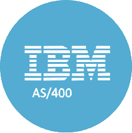

Hey My name is Tian Qiu
========================================================================================================================================

I am a recent Computer Science graduate and an aspiring developer
--------------------------

*   🌍  I'm based in Toronto, Canada
*   🖥️  See my portfolio at <a target="_blank" rel="noreferrer" href='https://www.vosp.us/wp-content/uploads/Under.jpg'>Portfolio </a>(under construction)
*   🧠  Currently learning Node.js
*   🤝  I'm open to collaborating on interesting projects as a developer
*   📸  Fun fact: I love <a target="_blank" rel="noreferrer" href='https://www.tianqqphotography.com/'>photography</a>, <a target="_blank" rel="noreferrer" href='https://www.youtube.com/@tianqq_'>cinematography</a>, hiking, and pumping iron 💪 

### Skills

<a href="https://dev.java/" target="_blank" rel="noreferrer"><a/a> &nbsp;
 &nbsp;
 &nbsp;
 &nbsp;
 &nbsp;
  &nbsp;
 &nbsp;  

### Editing

 &nbsp;<a href="https://www.adobe.com/ca/products/photoshop-lightroom.html" target="_blank" rel="noreferrer"> &nbsp;<a href="https://www.adobe.com/ca/products/premiere.html" target="_blank" rel="noreferrer"> &nbsp;<a href="https://www.blackmagicdesign.com/products/davinciresolve" target="_blank" rel="noreferrer">

### Socials

<a href="https://www.linkedin.com/in/tianqq/" target="_blank" rel="noreferrer"><a/a> &nbsp;  &nbsp;
 